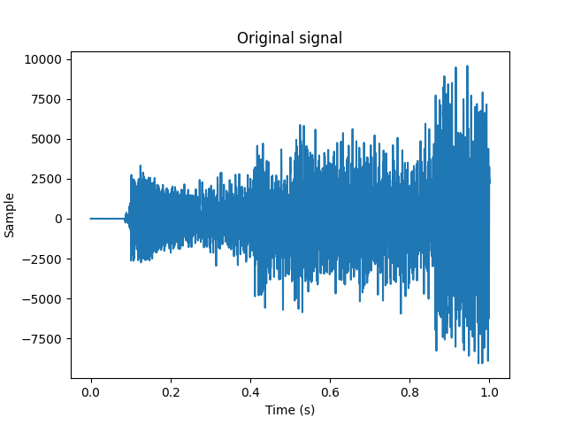
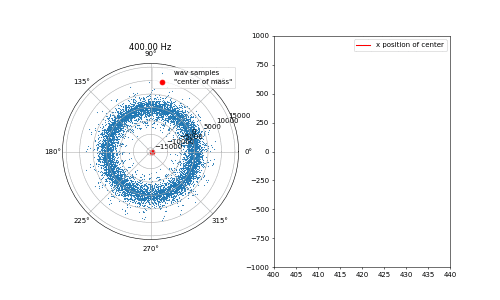
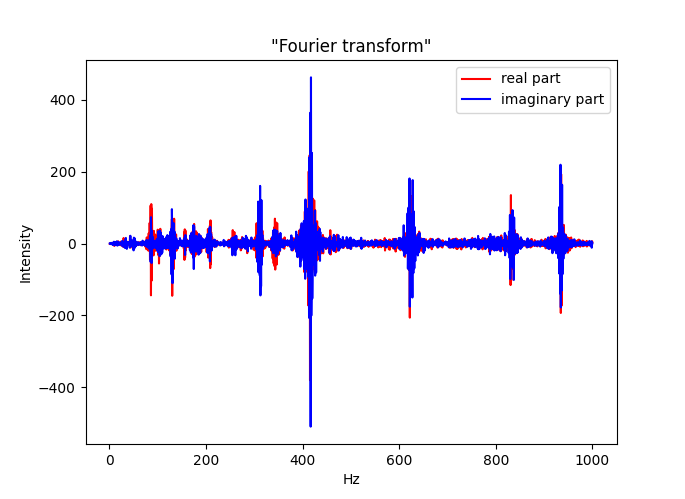

# slow-fourier-transform

Replicating part of the 3Blue1Brown Fourier transform [visualization](https://www.youtube.com/watch?v=spUNpyF58BY) on some real data.

## installation

`pip install -r requirements.txt`

## usage

`python3 transform.py input_path` 

Where input_path is the location of a .wav file of at least 1 second

## example

Using the `startup.wav` file as input, the script first plots the first second of the waveform data:

The waveform samples are then plotted on a polar coordinate axis, with time as the angular coordinate. The scaling of time to angle is increased over time, initially with 1 second of sound data covering one rotation around the polar axis ("1 hz"). 

The distance of the "center of mass" of these points from the origin indicates the intensity of the frequency in the plotted data.

An example of the animation from 400 to 440 hz, showing a peak around 415hz.

Plotting the horizontal and vertical shifts of this center of mass over a frequency range of 1 to 1000 hz gives us something analogous to the Fourier transform.

